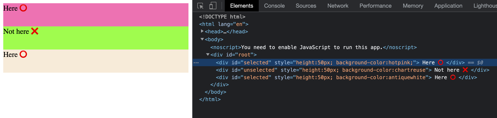
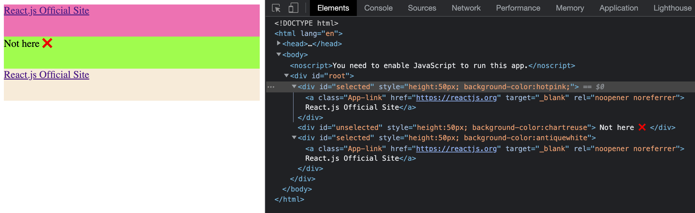

# Overview

This project shows how to insert rendering mechanisms into arbitrary multiple html elements.

## Run this app

In the project directory, you can execute `npm start`.\
You'll see the app runnning on [http://localhost:3000](http://localhost:3000) in the browser.

## Reference

This project was bootstrapped with [Create React App](https://github.com/facebook/create-react-app).

* [Create React App documentation](https://facebook.github.io/create-react-app/docs/getting-started).

* [React documentation](https://reactjs.org/).
